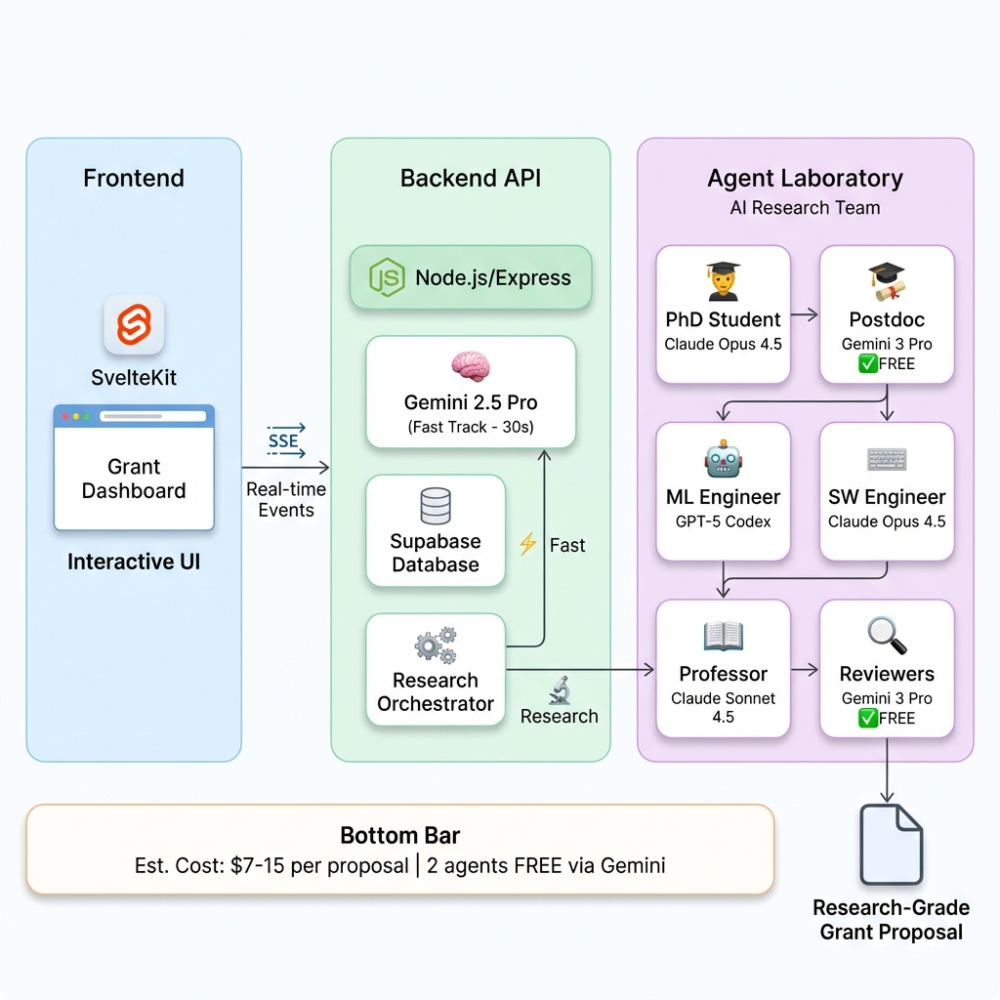

# 🚀 AI Grant Crawler A2A Pro

> **Production-ready autonomous grant discovery and proposal generation system** with MCP scrapers, A2A orchestration, multi-model AI agents, and real-time visualization.



---

## ✨ What This System Does

This is a **complete grant application automation platform** that:

1. **Discovers** relevant grants from multiple sources (EU Horizon, NSF, private foundations)
2. **Matches** grants to your company profile using AI-powered relevance scoring
3. **Generates proposals** in two modes:
   - ⚡ **Fast Track** (30 seconds) - Instant proposals via Gemini 2.5 Pro
   - 🔬 **Research Track** (5-15 minutes) - Deep autonomous research via AI Agent Laboratory

---

## 🏗️ System Architecture

The system follows a linear 4-phase pipeline, designed for autonomy and precision:

```mermaid
graph LR
    %% PHASE 1: DISCOVERY
    subgraph PHASE_1 [PHASE 1: DISCOVERY & MATCHING]
        direction TB
        Sources[Sources: EU/NSF/Foundations] --> Firecrawl[Firecrawl Engine]
        Firecrawl --> Analyzer[AI Feature/Relevance Extractor]
        Analyzer -->|Score > 50| DB[(Supabase DB)]
        Analyzer -->|Score < 50| Discard[Discard]
    end

    %% PHASE 2: INTERFACE
    subgraph PHASE_2 [PHASE 2: PLATFORM]
        DB <==>|Real-time| Dashboard[SvelteKit Dashboard]
        Dashboard -->|User Clicks Apply| API[API Gateway]
    end

    %% PHASE 3: ORCHESTRATION
    subgraph PHASE_3 [PHASE 3: ORCHESTRATION]
        API --> Strategy{Strategy Router}
        Strategy -->|Fast Track| Gemini[Gemini 2.5 Pro]
        Strategy -->|Research Track| LabRunner[Lab Orchestrator]
    end

    %% PHASE 4: AGENT LAB
    subgraph PHASE_4 [PHASE 4: AGENT LABORATORY]
        direction TB
        LabRunner --> PhD[PhD Student - Claude Opus 4.5]
        PhD --> Postdoc1[Postdoc Plan - Gemini 3 Pro]
        Postdoc1 --> Eng[ML and SW Engineers - GPT-5 Codex]
        Eng --> Postdoc2[Results Analysis - Gemini 3 Pro]
        Postdoc2 --> Prof[Professor Writing - Claude Sonnet 4.5]
        Prof --> Review[Review Board - Gemini 3 Pro]
        Review --> Final[Research-Grade Proposal]
    end
```



### 1. Discovery Engine (Automated)

- **Sources**: Continuously monitors EU Horizon, grants.gov, and private foundations.
- **Firecrawl**: Scrapes raw unstructured text from grant pages into Markdown.
- **AI Filter**: Uses Gemini Pro to extract standard metadata and calculate a **Relevance Score (0-100)** specific to your startup's profile. Only high-value matches enter the database.

### 2. Dual-Track Processing

Once a user selects "Apply", the system routes the request based on depth needs:

- **Fast Track**: Uses a single-shot prompt with Gemini 2.5 Pro for instant (~30s) drafts.
- **Research Track**: Activates the **Agent Laboratory** (below) for deep investigation.

---

---

## 🤖 AI Research Laboratory - Agent Workflow

The **Research Track** uses a team of 6 specialized AI agents, each running on the **optimal model** for their task:

```
╔══════════════════════════════════════════════════════════════════════════════════════╗
║                        🔬 AI RESEARCH LABORATORY WORKFLOW                             ║
║                      Maximum Quality Multi-Model Orchestration                        ║
╠══════════════════════════════════════════════════════════════════════════════════════╣
║                                                                                       ║
║     PHASE 1: LITERATURE REVIEW                                                        ║
║     ┌─────────────────────────────────────────────────────────────────────────────┐  ║
║     │  📚 PhD Student Agent                                                        │  ║
║     │  ─────────────────────────────────────────────────────────────────────────  │  ║
║     │  Model: Claude Opus 4.5 (Reasoning)        Cost: ~$2.50/run                 │  ║
║     │  Why: Best reasoning (69.77 score), excellent research synthesis            │  ║
║     │                                                                              │  ║
║     │  Tasks:                                                                      │  ║
║     │  • Search academic papers related to grant topic                            │  ║
║     │  • Analyze 10-20 relevant publications                                      │  ║
║     │  • Extract key methodologies and findings                                   │  ║
║     │  • Identify research gaps and opportunities                                 │  ║
║     │                                                                              │  ║
║     │  Output: Literature review summary, cited sources, key insights            │  ║
║     └─────────────────────────────────────────────────────────────────────────────┘  ║
║                                          │                                            ║
║                                          ▼                                            ║
║     PHASE 2: PLAN FORMULATION                                                         ║
║     ┌─────────────────────────────────────────────────────────────────────────────┐  ║
║     │  📋 Postdoc Agent                                                            │  ║
║     │  ─────────────────────────────────────────────────────────────────────────  │  ║
║     │  Model: Gemini 3 Pro (high)                Cost: FREE ✨                    │  ║
║     │  Why: Top reasoning (72.85 score), 95.67% math, FREE via Gemini API         │  ║
║     │                                                                              │  ║
║     │  Tasks:                                                                      │  ║
║     │  • Synthesize literature findings                                           │  ║
║     │  • Formulate research methodology                                           │  ║
║     │  • Define project milestones and deliverables                               │  ║
║     │  • Create detailed research plan                                            │  ║
║     │                                                                              │  ║
║     │  Output: Research plan, methodology, timeline, success metrics              │  ║
║     └─────────────────────────────────────────────────────────────────────────────┘  ║
║                                          │                                            ║
║                                          ▼                                            ║
║     PHASE 3: DATA PREPARATION                                                         ║
║     ┌─────────────────────────────────────────────────────────────────────────────┐  ║
║     │  📊 ML Engineer Agent          +          🔧 SW Engineer Agent               │  ║
║     │  ─────────────────────────────────────────────────────────────────────────  │  ║
║     │  ML Model: GPT-5 Codex (high)              Cost: ~$1.00/run                 │  ║
║     │  SW Model: Claude Opus 4.5                 Cost: ~$2.00/run                 │  ║
║     │  Why: GPT-5 Codex has 98.67% math, Claude has 87.1% LiveCodeBench           │  ║
║     │                                                                              │  ║
║     │  Tasks (ML Engineer):                                                        │  ║
║     │  • Identify required datasets                                               │  ║
║     │  • Design data collection strategy                                          │  ║
║     │  • Prepare data processing pipelines                                        │  ║
║     │                                                                              │  ║
║     │  Tasks (SW Engineer):                                                        │  ║
║     │  • Set up development environment                                           │  ║
║     │  • Implement data loaders and transformations                               │  ║
║     │  • Ensure code quality and documentation                                    │  ║
║     │                                                                              │  ║
║     │  Output: Dataset specifications, code implementations, requirements.txt     │  ║
║     └─────────────────────────────────────────────────────────────────────────────┘  ║
║                                          │                                            ║
║                                          ▼                                            ║
║     PHASE 4: RUNNING EXPERIMENTS                                                      ║
║     ┌─────────────────────────────────────────────────────────────────────────────┐  ║
║     │  🧪 ML Engineer Agent (continued)                                            │  ║
║     │  ─────────────────────────────────────────────────────────────────────────  │  ║
║     │  Model: GPT-5 Codex (high)                 Cost: (included above)           │  ║
║     │                                                                              │  ║
║     │  Tasks:                                                                      │  ║
║     │  • Execute experimental protocols                                           │  ║
║     │  • Run simulations and benchmarks                                           │  ║
║     │  • Collect and validate results                                             │  ║
║     │  • Generate visualizations                                                  │  ║
║     │                                                                              │  ║
║     │  Output: Experimental results, charts, performance metrics                  │  ║
║     └─────────────────────────────────────────────────────────────────────────────┘  ║
║                                          │                                            ║
║                                          ▼                                            ║
║     PHASE 5: RESULTS INTERPRETATION                                                   ║
║     ┌─────────────────────────────────────────────────────────────────────────────┐  ║
║     │  📈 Postdoc Agent (continued)                                                │  ║
║     │  ─────────────────────────────────────────────────────────────────────────  │  ║
║     │  Model: Gemini 3 Pro (high)                Cost: FREE ✨                    │  ║
║     │                                                                              │  ║
║     │  Tasks:                                                                      │  ║
║     │  • Analyze experimental outcomes                                            │  ║
║     │  • Compare results to initial hypotheses                                    │  ║
║     │  • Identify key findings and implications                                   │  ║
║     │  • Assess alignment with grant objectives                                   │  ║
║     │                                                                              │  ║
║     │  Output: Results analysis, key findings, comparison to objectives          │  ║
║     └─────────────────────────────────────────────────────────────────────────────┘  ║
║                                          │                                            ║
║                                          ▼                                            ║
║     PHASE 6: REPORT WRITING                                                           ║
║     ┌─────────────────────────────────────────────────────────────────────────────┐  ║
║     │  📝 Professor Agent                                                          │  ║
║     │  ─────────────────────────────────────────────────────────────────────────  │  ║
║     │  Model: Claude Sonnet 4.5 (Reasoning)      Cost: ~$1.50/run                 │  ║
║     │  Why: Excellent writing quality + reasoning balance                          │  ║
║     │                                                                              │  ║
║     │  Tasks:                                                                      │  ║
║     │  • Structure the grant proposal                                             │  ║
║     │  • Write executive summary                                                  │  ║
║     │  • Compose methodology section                                              │  ║
║     │  • Draft budget justification                                               │  ║
║     │  • Create impact statement                                                  │  ║
║     │                                                                              │  ║
║     │  Output: Complete grant proposal draft in LaTeX/Markdown                    │  ║
║     └─────────────────────────────────────────────────────────────────────────────┘  ║
║                                          │                                            ║
║                                          ▼                                            ║
║     PHASE 7: QUALITY REVIEW & REFINEMENT                                              ║
║     ┌─────────────────────────────────────────────────────────────────────────────┐  ║
║     │  ✨ Reviewers Panel                                                          │  ║
║     │  ─────────────────────────────────────────────────────────────────────────  │  ║
║     │  Model: Gemini 3 Pro (high)                Cost: FREE ✨                    │  ║
║     │  Why: Top GPQA (90.8%), rigorous logical reasoning                          │  ║
║     │                                                                              │  ║
║     │  Tasks:                                                                      │  ║
║     │  • Score proposal on multiple criteria                                      │  ║
║     │  • Identify weaknesses and gaps                                             │  ║
║     │  • Suggest specific improvements                                            │  ║
║     │  • Verify alignment with grant requirements                                 │  ║
║     │  • Final quality assessment                                                 │  ║
║     │                                                                              │  ║
║     │  Output: Review scores, improvement suggestions, final approval            │  ║
║     └─────────────────────────────────────────────────────────────────────────────┘  ║
║                                          │                                            ║
║                                          ▼                                            ║
║     ┌─────────────────────────────────────────────────────────────────────────────┐  ║
║     │                    📄 FINAL OUTPUT: RESEARCH-GRADE PROPOSAL                  │  ║
║     │                                                                              │  ║
║     │  • Complete grant proposal with citations                                   │  ║
║     │  • Detailed methodology and timeline                                        │  ║
║     │  • Budget breakdown and justification                                       │  ║
║     │  • Impact statement and broader implications                                │  ║
║     │  • Quality score and confidence rating                                      │  ║
║     └─────────────────────────────────────────────────────────────────────────────┘  ║
║                                                                                       ║
╠══════════════════════════════════════════════════════════════════════════════════════╣
║  💰 COST SUMMARY (per research run)                                                   ║
║  ─────────────────────────────────────────────────────────────────────────────────── ║
║  PhD Student (Claude Opus 4.5):     $2.50                                            ║
║  Postdoc (Gemini 3 Pro):            $0.00  ← FREE!                                   ║
║  ML Engineer (GPT-5 Codex):         $1.00                                            ║
║  SW Engineer (Claude Opus 4.5):     $2.00                                            ║
║  Professor (Claude Sonnet 4.5):     $1.50                                            ║
║  Reviewers (Gemini 3 Pro):          $0.00  ← FREE!                                   ║
║  ─────────────────────────────────────────────────────────────────────────────────── ║
║  TOTAL ESTIMATED COST:              $7.00 - $15.00 per proposal                      ║
╚══════════════════════════════════════════════════════════════════════════════════════╝
```

---

## 🚀 Quick Start

### Prerequisites

- Node.js 18+
- Python 3.10+ (for Research Track)
- Supabase account (free tier works)
- API Keys:
  - **Gemini API** (free, required)
  - **OpenRouter API** (for Maximum Quality mode, ~$20 credit recommended)

### Backend Setup

```bash
cd backend
npm install

# Copy environment template
cp .env.example .env

# Edit .env with your API keys:
# - SUPABASE_URL
# - SUPABASE_ANON_KEY
# - GEMINI_API_KEY (free from Google AI Studio)
# - OPENROUTER_API_KEY (for Maximum Quality mode)

npm run dev
```

> **Note**: For production deployment, you must set `PUBLIC_API_URL` in your frontend environment (e.g., Vercel) to point to the live public URL of the deployed backend service (e.g., `https://your-backend.up.railway.app/api`).

**Database Setup**: Run `schema.sql` in your Supabase SQL editor.

### Frontend Setup

```bash
cd frontend
npm install
npm run dev
```

### AI-Researcher Setup (Optional - for Research Track)

**Windows Users**: Requires Microsoft Visual C++ 14.0+ Build Tools

```bash
# Install from: https://visualstudio.microsoft.com/visual-cpp-build-tools/
```

**Then for all platforms**:

```bash
cd backend/ai-researcher
pip install -e .
playwright install
```

---

## 📁 Project Structure

```
ai-grant-crawler-a2a-pro/
│
├── backend/                      # Node.js/Express API Server
│   ├── src/
│   │   ├── routes/               # API endpoints
│   │   │   ├── grants.js         # Grant CRUD operations
│   │   │   └── proposals.js      # Proposal generation endpoints
│   │   ├── services/
│   │   │   ├── grantMatcher.js   # AI relevance scoring
│   │   │   └── aiResearcher.js   # Research Track orchestration
│   │   ├── config/
│   │   │   └── gemini.js         # Gemini 3 Pro configuration
│   │   └── utils/
│   │       └── sseHelper.js      # Server-Sent Events streaming
│   │
│   └── ai-researcher/            # Python AI Research Laboratory
│       ├── agents.py             # Agent class definitions
│       ├── agent_models.py       # Per-agent model configuration ✨ NEW
│       ├── inference.py          # Multi-provider API (OpenRouter, Gemini, OpenAI)
│       ├── ai_lab_repo.py        # Main workflow orchestrator
│       └── experiment_configs/   # YAML experiment configurations
│
├── frontend/                     # SvelteKit Application
│   ├── src/
│   │   ├── routes/
│   │   │   ├── +page.svelte      # Grant dashboard
│   │   │   └── thinktank/
│   │   │       └── [grantId]/    # Research visualization page
│   │   └── lib/
│   │       └── components/       # Reusable UI components
│   │
│   └── static/                   # Static assets
│
└── docs/                         # Documentation & diagrams
```

---

## 🔑 API Keys Configuration

### Required

| Key              | Provider                                                     | Cost | Used For                       |
| ---------------- | ------------------------------------------------------------ | ---- | ------------------------------ |
| `GEMINI_API_KEY` | [Google AI Studio](https://makersuite.google.com/app/apikey) | FREE | Postdoc, Reviewers, Fast Track |

### For Maximum Quality Mode

| Key                  | Provider                                 | Cost      | Used For                                        |
| -------------------- | ---------------------------------------- | --------- | ----------------------------------------------- |
| `OPENROUTER_API_KEY` | [OpenRouter](https://openrouter.ai/keys) | ~$20+/run | Claude Opus 4.5, GPT-5 Codex, Claude Sonnet 4.5 |

---

## 📊 Model Benchmark Sources

The model selections are based on December 2024-2025 benchmark data from:

- [Artificial Analysis Leaderboard](https://artificialanalysis.ai/leaderboards/models)
- AIME 2025, GPQA Diamond, LiveCodeBench, HumanEval

---

## 🔬 Scientific Basis & Methodology

This system implements the **Agent Laboratory** framework as detailed in the paper _[Agent Laboratory: Using LLM Agents as Research Assistants](https://arxiv.org/abs/2501.04227)_ (Schmidgall et al., 2025).

The architecture faithfully reproduces the paper's three-phase autonomous research workflow:

1.  **Literature Review Phase**: Implements the paper's "PhD Student" agent role to query arXiv/Semantic Scholar, performing independent literature synthesis rather than simple summarization.
2.  **Experimentation Phase**: Utilizes the **MLE-Solver** methodology described in the paper, where an ML Engineer agent iteratively refines code based on error traces and performance metrics (achieving state-of-the-art performance on benchmarks).
3.  **Report Writing Phase**: Adopts the "Professor" agent persona to synthesize findings into a coherent narrative, separating ideation (human/agent collaboration) from the labor of drafting.

> **Research Impact**: The original study demonstrated that this multi-agent approach reduces research costs by **84%** compared to traditional methods while maintaining or exceeding human-level quality in comparable tasks.

---

## 📝 License

MIT License - feel free to use this for your grant applications!

---

## 🙏 Acknowledgments

- **Agent Laboratory** - Original research agent framework
- **Anthropic, Google, OpenAI, DeepSeek** - For the amazing AI models
- **You** - For building the future of automated grant writing!
